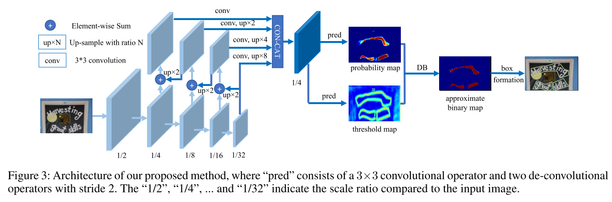

# Real-time Scene Text Detection with Differentiable Binarization

## Introduction

<p align="center">
    
</p>

The Differential Binarization (DB) Algorithm is one of the cutting-edge approaches to effectively detect curved text. 
+ Improved Text Detection: The algorithm excels at accurately identifying text within images, even when it's curved or distorted.
+ Accurate Text Recognition: It paves the way for more precise text recognition, ensuring that the text is correctly extracted and understood.

## Environment
The dependencies are listed in requirements.txt. Please install and follow the command below:

```bash
pip install -r requirements.txt
```

## Data preparation

Please download [ICDAR2015](https://rrc.cvc.uab.es/?ch=4&com=downloads) dataset and setup the folder structure:

```bash
dataset/icdar2015
|test
|____|gt
|____|______gt_img_1.txt
|____|______gt_img_2.txt
|____|images
|____|______img_1.jpg
|____|______img_2.jpg
|train
|____|______gt_img_1.txt
|____|______gt_img_2.txt
|____|images
|____|______img_1.jpg
|____|______img_2.jpg
```

## Training
Before training, please modify configurations in `src/configs/det_icdar2015.yml`
```bash
python -m src.train
```

## Evaluation

```bash
python -m src.evaluate
```

## Prediction

```bash
python -m src.predict
```

## Experiments
