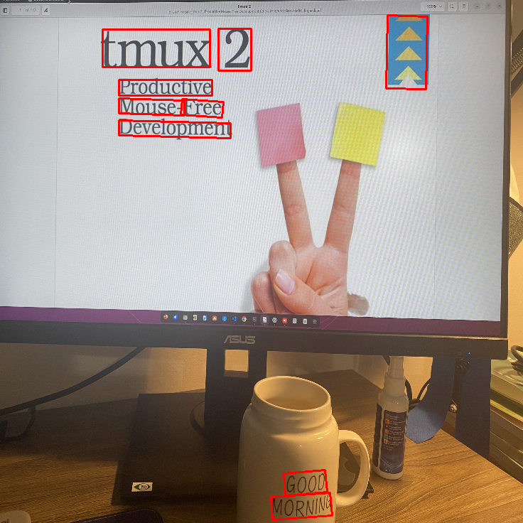

# Real-time Scene Text Detection with Differentiable Binarization

## Introduction

<p align="center">
    
</p>

The Differential Binarization (DB) Algorithm is one of the cutting-edge approaches to effectively detect curved text. 
+ Improved Text Detection: The algorithm excels at accurately identifying text within images, even when it's curved or distorted.
+ Accurate Text Recognition: It paves the way for more precise text recognition, ensuring that the text is correctly extracted and understood.

## Environment
The dependencies are listed in requirements.txt. Please install and follow the command below:

```bash
pip install -r requirements.txt
```

## Data preparation
Please download the [ICDAR2015](https://rrc.cvc.uab.es/?ch=4&com=downloads) and [TotalText]() dataset and set up the folder structure:

```bash
dataset/icdar2015
|test
|____|gt
|____|______gt_img_1.txt
|____|______gt_img_2.txt
|____|images
|____|______img_1.jpg
|____|______img_2.jpg
|train
|____|gt
|____|______gt_img_1.txt
|____|______gt_img_2.txt
|____|images
|____|______img_1.jpg
|____|______img_2.jpg
```

## Training
Before training, please modify configurations in `src/configs/det_icdar2015.yml`
```bash
python -m src.train
```

## Evaluation

```bash
python -m src.evaluate
```

## Prediction

```bash
python -m src.predict --image_path <path_to_image>
```

Example:

```bash
python -m src.predict --image_path images/example.jpg
```

<p align="center">
    
</p>

<p align="center">
    
</p>


## Experiments

|Export format|image size|mAP|mAP_50|mAP_75| Inference time (RTX3060)| learning rate |
|--|--|--|--|--|--|--|
|Pytorch - ResNet18|736x736| 0.36 | 0.65 | 0.36 | 0.003s | 0.0005 |
|TorchScript - ResNet18| 736x736 |0.36 | 0.65 | 0.36 | 0.0018s | - |
|Pytorch - ResNet50|736x736| 0.39 | 0.69 | 0.40 | 0.003s | 0.007 |
|TorchScript - ResNet18| 736x736 | 0.39 | 0.69 | 0.40  | 0.004s | - |


## Reference

>+ [https://github.com/MhLiao/DB](https://github.com/MhLiao/DB)
>+ [Real-time Scene Text Detection with Differentiable Binarization](https://arxiv.org/abs/1911.08947)