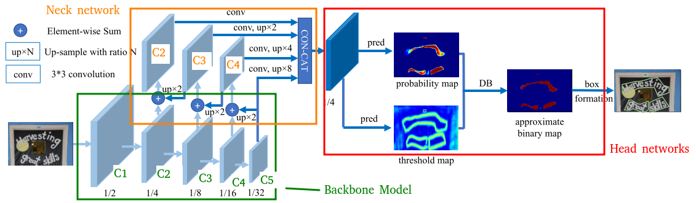

# Understanding of Architecture Network

The Differential Binarization (DB) Algorithm is one of the cutting-edge approaches to effectively detect curved text. 
+ Improved Text Detection: The algorithm excels at accurately identifying text within images, even when it's curved or distorted.
+ Accurate Text Recognition: It paves the way for more precise text recognition, ensuring that the text is correctly extracted and understood.
  
DB works quite well when using a lightweight backbone, which significantly enhances the detection performance with a backbone of ResNet-18. In the Neck network, the features are up-sampled to the same scale and cascaded to produce feature $F$. Then, feature $F$ is used to predict both the probability map $P$ and threshold map $T$ in the Head network.
After that, the approximate binary map $B$ is calculated by $P$ and $F$.

<p align="center">
    
</p>

## 1. Backbone

First, we use extracted features from the different scales of layers (layers 1, 2, 3, 4) in the ResNet-18 backbone

```python
from __future__ import division
from __future__ import print_function
from __future__ import absolute_import

import torch
import torchvision
import torch.nn as nn
import torch.nn.functional as F


class BackboneDB(nn.Module):
    def __init__(self) -> None:
        super(BackboneDB, self).__init__()
        backbone = torchvision.models.resnet18(weights=torchvision.models.ResNet18_Weights.DEFAULT)

        self.conv1 = backbone.conv1
        self.bn1 = backbone.bn1
        self.relu = backbone.relu
        self.maxpool = backbone.maxpool
        # Features
        self.layer1 = backbone.layer1 # 1/4
        self.layer2 = backbone.layer2 # 1/8
        self.layer3 = backbone.layer3 # 1/16
        self.layer4 = backbone.layer4 # 1/32
        # Out channels
        self.out_channels = [self.layer1[-1].conv2.out_channels,
                             self.layer2[-1].conv2.out_channels,
                             self.layer3[-1].conv2.out_channels,
                             self.layer4[-1].conv2.out_channels]

    
    def forward(self, x):
        x = self.conv1(x)
        x = self.bn1(x)
        x = self.relu(x)
        x = self.maxpool(x)

        x2 = self.layer1(x)
        x3 = self.layer2(x2)
        x4 = self.layer3(x3)
        x5 = self.layer4(x4)
        
        return x2, x3, x4, x5
```

## 2. Neck Network
<p align="center">
    
</p>

Assume that, features from the backbone network $C = \lbrace C_1, C_2, C_3, C_4, C_5 \rbrace$.
Next, the features are up-sampled to the same scale and cascaded to produce feature $F$ following steps:

**Upscales and element-wise sum of features from C5 to C2**

$C_4 = C_4 \oplus up_{\times2}(C_5)$

$C_3 = C_3 \oplus up_{\times2}(C_4)$

$C_2 = C_2 \oplus up_{\times2}(C_3)$

**Upscale features to the same scale and concatenate them together**

$C_2 = conv_{3 \times 3}(C_2)$

$C_3 = up_{\times2}(conv_{3 \times 3}(C_3))$

$C_4 = up_{\times4}(conv_{3 \times 3}(C_4))$

$C_5 = up_{\times8}(conv_{3 \times 3}(C_5))$

$=> F = C_2+C_3+C_4+C_5$

**Notion**

|Symbol| Meaning|
|--|--|
|$\oplus$| Element-wise|
|$up_{\times N}$| Interpolate function in Pytorch|
|$conv_{3\times 3}$| Conv 3x3 + BN + ReLu|
|$+$ | Concatenate |

## 3. Head Network
Before having the final result with a polygon/bounding box of text, we need to process two important predictions: **probability map**, **threshold map** and **approximate binary map**.

**probability map** is a binary feature map, the predicted area of text is `1` value, otherwise is `0` value. From the $F$ feature in the Neck network, we use a binary module to map $F \to P$:

```python
from __future__ import division
from __future__ import print_function
from __future__ import absolute_import

import torch
from torch import nn


binarize = nn.Sequential(
        nn.Conv2d(in_channels, in_channels // 4, 3, padding=1),
        nn.BatchNorm2d(in_channels // 4),
        nn.ReLU(inplace=True),
        nn.ConvTranspose2d(in_channels // 4, in_channels // 4, 2, 2),
        nn.BatchNorm2d(in_channels // 4),
        nn.ReLU(inplace=True),
        nn.ConvTranspose2d(in_channels // 4, 1, 2, 2),
        nn.Sigmoid())
```

**threshold map** is also a binary feature map, the predicted boundary line of text is `0` value, otherwise is `1` value. From the $F$ feature in the Neck network, we use a thresh module to map $F \to T$

Finally, the **approximate binary map** is predicted by an approximate step function:

$$B = \frac{1}{1+e^{k(P-T)}}$$

where $B$ is the approximate binary map, $T$ is the threshold map and $P$ is the probability map.

```python
def approximate_step_function(P, T, k=50):
    return torch.reciprocal(1 + torch.exp(-k * (P - T)))
```