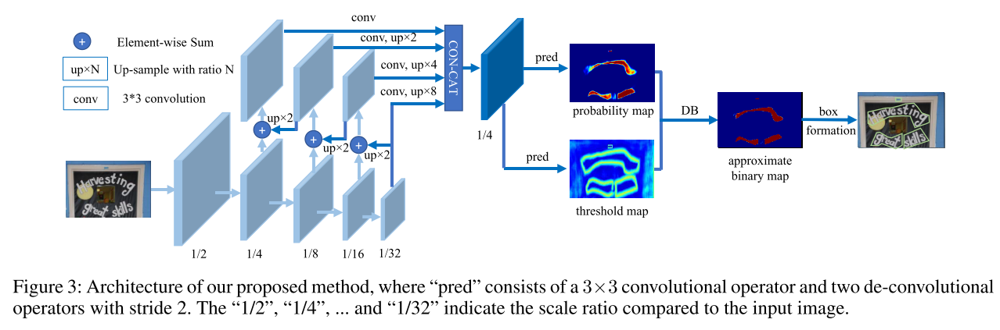

# Understanding of Architecture Network

The Differential Binarization Algorithm is one of the cutting-edge approaches to effectively detect curved text. 
+ Improved Text Detection: The algorithm excels at accurately identifying text within images, even when it's curved or distorted.
+ Accurate Text Recognition: It paves the way for more precise text recognition, ensuring that the text is correctly extracted and understood.
  
DB works quite well when using a light-weight backbone, which significantly enhances the detection performance with a backbone of ResNet-18

    

## 1. Backbone